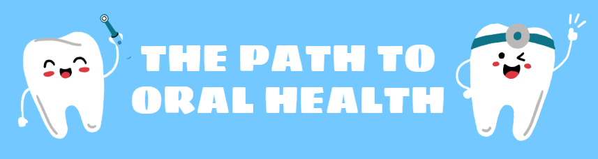
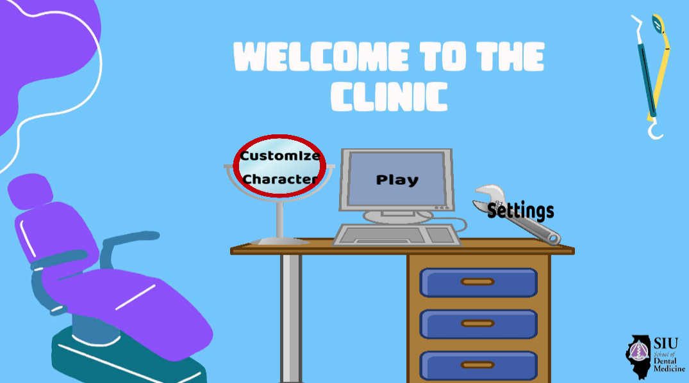
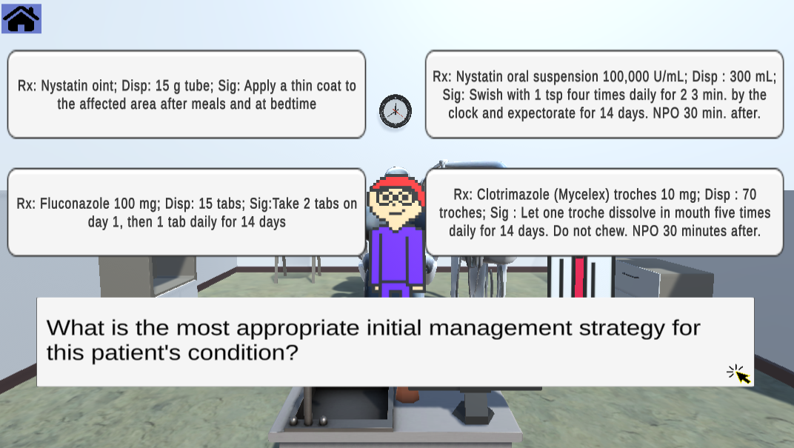

# The Path of Oral Health

An Educational Serious game being developed in the Oral Medicine Field to help students retain information easier. 
Developed using Unity, built using WEBGL, data storage using Firebase Firestore, and deployed on itch.io.

## 🚀 Live Demo
[Click Here!](https://nimorga.itch.io/the-path-of-oral-health)
Happy Playing!😊

| Main Menu | Gameplay |
|-------------|-----------------|
|  |  |

## Table of Contents

- [Description](#-description)
- [Getting Started](#getting-started)
- [Installing](#-installing)
- [Asset File Structure](#-asset-file-structure)
- [Important Files](#-important-files)
- [The Testing Process](#the-testing-process)
- [Repositories Used](#repositiories-used)
- [Contributors](#-the-team-dental-hygeniuses)
- [License](#license)
- [Acknowledgments](#acknowledgments)

## 📝 Description

The problem we addresed with this game that our clients reached out for is the trouble of making studying engaging and the difficulties of retaining information. So, our game provides interactive learning, engaging content, allows for rentention of difficult terms, and is being used for a Research Paper to track the findings and benefits of educational games in the learning enviroment!

## Getting Started
#### Step 1) Follow the documentation installation process to get you started with the correct Unity enviroment and Visual Studio Code. 

#### Step 2) Link up your [Firestore Database ](https://console.firebase.google.com/project/dentalgame-891d0/overview)

#### Step 3) Install GitHub Desktop. (Trust me it will make things so much easier for collaboration!)

#### Step 4) Read documentation to get familirzed with the scripts, prefabs, and interworkings.

## ⚙️ Dependencies
- Unity 2021.3.33f1
- TextMeshPro (for UI text rendering)
- Firebase Firestore (Storage of Player Information)

## 📂 Asset File Structure
- Audio (Stores Music and Voices)
- Editor Default Resources (Firebase Package)
- ExternalDependencyManager
- Firebase (Firebase Package)
- FirebaseWebGL (Firebase Package)
- FreeUnityAssets (Assets used in Game Grabbed from Unity Store)
- FullSerializer
- Images (Contains UI, Images used for Noxtium, and general settings)
- Materials (Holds materials of all items through the game, especailly character customization)
- Plugins
- Prefabs (Important prefabs include Character, NPC, LevelSelector, Noxium)
- ResetClient
- Scenes 
- Scripts (All the scripts used to run the game)
- SimpleJSON-master (Imported Package)
- TextMeshPro

## 🗃 Important Files
- index.html (Used when you bulid with WEBGL)

- Drag and Drop these folders text files in the inspector:
    - Text Anwsers DIA_MED: Drop location is LevelButtonManager in LevelButtonManager Script in Level Scenes (Stores .txt of the DIA and MED button information for each level)
    - Text Dialogue Scripts: Drop location is NPC hoverdetecor in Level Scenes (Stores .txt of dialogue interaction)
    - Text for Notes: Drop location is LevelButtonManager in AxiumDisplay Script in Level Scenes (Stores .txt of the Medical History and Notes for the Noxium display)

## 💻 Installing
#### Step 1) Download the code from the GitHub Repo here.
#### Step 2) Follow this [Youtube video](https://www.youtube.com/watch?v=pn1YgU81GUY&t=14s) on creating a GitHub repository with the now downloaded package.
#### Step 3) Open your Unity Engine with the newly connected GitHub repo to your game!

## The Testing Process
Follow these steps to build and deploy the Unity game to using WebGL:

### Step-by-Step Instructions

1. **Open Build Settings**
   - In Unity, navigate to `File` → `Build Settings`.

2. **Switch Platform to WebGL**
   - In the platform list, select **WebGL**.
   - Click `Switch Platform`.

3. **Add Scenes to Build**
   - Ensure all necessary scenes are listed in the "Scenes in Build" area.
   - Use the `Add Open Scenes` button if needed.

4. **Clean Previous Builds**
   - If this is your first build (or if issues occur), delete any existing WebGL build folder.
   - Create a new folder such as `Build/WebGL`.

6. **Build the Project**
   - In `Build Settings`, click `Build`.
   - Choose the clean `Build/WebGL` folder as your output path.

7. **Zip the Build Output**
   - After the build is complete, open the `Build/WebGL` folder.
   - Select the **contents** (e.g., `index.html`, `Build/`, `TemplateData/`) — not the folder itself.
   - Right-click → `Send to > Compressed (zipped) folder`.

8. **Upload to Itch.io**
   - Go to your game’s location.
   - Click **Edit game** → Scroll to **Uploads**.
   - Upload the `.zip` file you just created.
   - Under **"Kind of project"**, choose **HTML**.
   - Make sure to check **"This file will be played in the browser"**.

19. **Save and Test**
   - Click **Save** at the bottom.
   - Open your public game page to test that it runs in-browser.

You must have patientence... the average build of the game takes around 5 - 10 minutes. From there you upload it to itch.io by compressing the built folder of the game and uploading it where it states upload.

## Repositiories Used
[Firebase WebGL](https://github.com/rotolonico/FirebaseWebGL)

[SimpleJSON](https://github.com/Bunny83/SimpleJSON/tree/master)

## 🦷 The Team: Dental Hygeniuses

[Alex Wernex](https://github.com/SquatchOut1)

[Jarod Spencer](https://github.com/TheJarodSpencer)

[Sophia Miller](https://github.com/sopmill)

[Nicole Morgan](https://github.com/nimorga)  

## License

SIU School of Dental Medicine

Southern Illinois University Edwardsville

## Acknowledgments

We would like to thank both of our amazing clients, Dr.Eilerman and Dr.Davila, for allowing us this oppurtunity to work on something so exciting and inspiration for future dental students!

We would also like to extend our graditude and thanks to Dr. Das for dividing up the senior projects that landed our group here to work on this education game!
